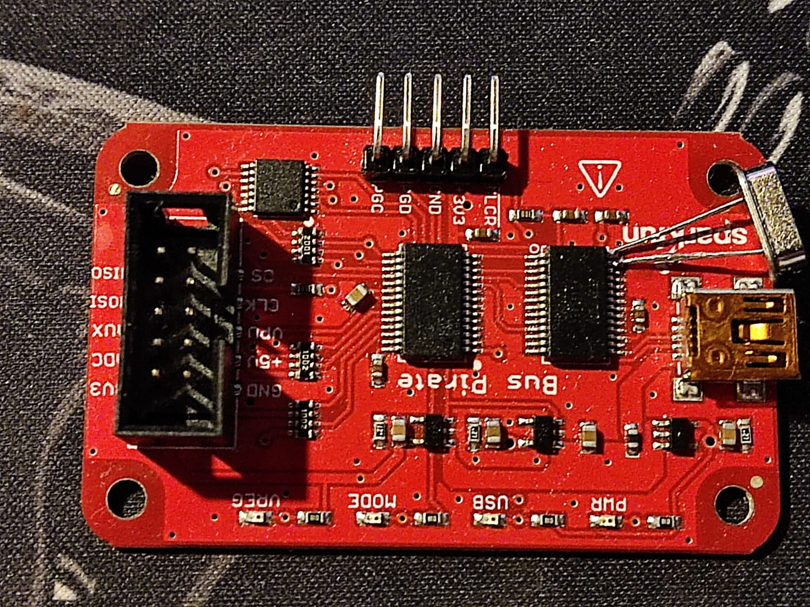
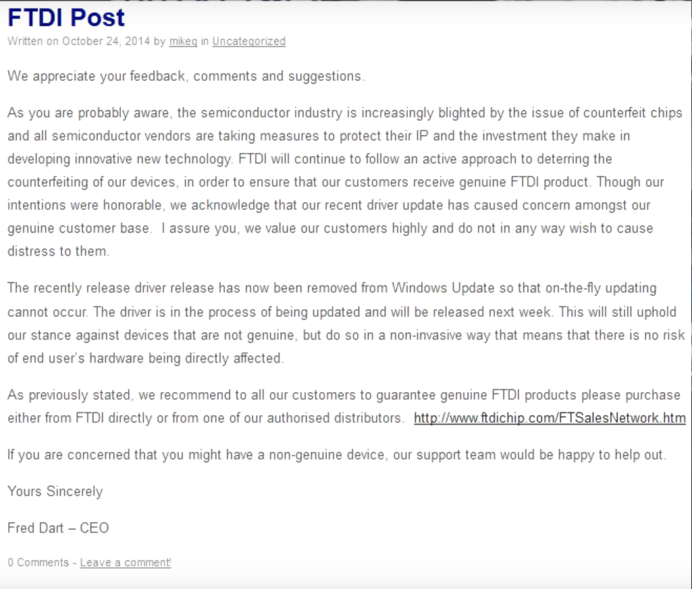
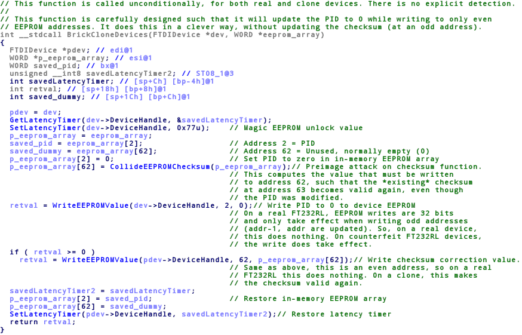
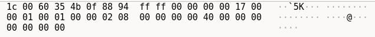
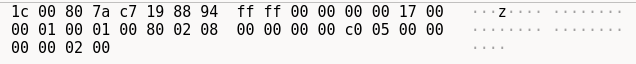
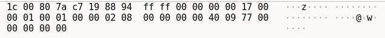
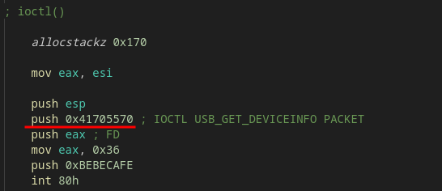

# `FTDIBRICK`
@FTDIChip How dangerous do you consider it that a non-admin user running a user-space program can communicate with the FTDI driver, program the EEPROM, and brick it? Does that seem normal to you?

We made some POC's to brick the original FT232R when it doesn't use an external clock (almost all boards, right?) FreeBSD+Windows+Linux. On Windows from non-admin user. The unique way to reverse this is to solder a proper 12Mhz clock to the OSCO and OSCI pins of the chip:



Project by https://github.com/S0S4 & https://github.com/therealdreg

---

# WHAT IS FTDI?

FTDI is a semiconductor company. It is heavily known for it's USB-UART chips (FTDI 232R, FTDI 245R ...) among other stuff like the well known USB MPSSE Cable Series (CH232HM) etc.

# FTDI DRIVER BRICKING FAKE CHIPS
Back in 2014 FTDI, manufacturers of the most popular USB to serial conversion chip, **released an update to their drivers that bricked FTDI fakes**. These fakes were extremely common in the supply chain, even if you bought a cheap arduino you probably have one of this fake chips. When you buy electronics, you don't know if the chips they are using are original or not. This new driver could break their new stuff! Even for advanced users, detecting if a FTDI chip is fake or not can be a jigsaw puzzle.

FTDI was heavily criticized because of this. Not only for refusing to talk to counterfeit chips, but for deliberately bricking the chinese fakes without a clear announcement (They advised the bricking of counterfeit chips in the Terms and Conditions, which was tucked away inside the driver file). After the critics they backed off and proceed with a new idea, this driver was eliminated from Windows update.


Weeks later, After a CEO statement, they launched the `ftdi-gate v2.0` a new driver that will inject garbage data into the fake chip so the Windows FTDI driver will output "NON GENUINE DEVICE FOUND" and will refuse to talk to the chip.



### How FTDI brick devices?
Every USB device has a pair of IDs. One, the Vendor ID (VID), which is given by the [USB Group](https://usb.org/). The second is a Product ID, allocated by the vendor, with each distinct chip type having its own PID. Windows uses this VID/PID to figure out which driver the hardware needs. This fake chips uses the FTDI VID and set the PID to the PID of the chip they are cloning.

Back in 2014, the driver was on Windows update, when you connected your fake FTDI into Windows, It will start downloading the latest driver for the FTDI, in this case, the bricker driver.

What this driver did was to reprogram the EEPROM of this counterfeit chips and set the PID to 0000. This PID does not match with any FTDI part, so Windows drivers no longer recognize the chip. As the PID is on the EEPROM, the programming to 0000 is persistent.

### Diving deep
We have superficially explained how the brick process work, but let's get our hands dirty and go a bit deeper.

The user [marcan](https://marcan.st) reverse engineered the FTDI driver. The source code of the brick was kind of clever, the code exploits the differences found in the silicon of the counterfeit chips compared to the legit ones.



The eeprom needs to be written in 32-bit units, writes to even addresses are buffered and writes to odd addresses writes the 32 bits at once, the 16 buffered bits and the supplied 16 bits. The function does a 16 bit time transfer, on an official FTDI you need to write the EEPROM sequentially by writing 32 bits at a time, so, when using this function on an official FTDI you will send the first 16 bits to a buffer then buffer other 16 bits and then writing to the eeprom, meanwhile, the counterfeit FTDI's issues 16-bit writings (following the documentation on FTDI this should be the case for official FTDI, but the clones implemented the command interface better than FTDI, kind of hilarous).

For the checksum they did something smart, they don't create a new checksum and write it on the FTDI,**but find the value required to make the existing checksum match and write it on the previous address to the checksum**

---

## Windows

For Windows we decided to use their driver as it let us brick the chip without administrator privileges.

src/windows_ftdibrick -> Assembly POC tested and fully working

src/ftdibrickerd2xx

src/ftdibrickerd2xx_static

src/ftdibrickwin32_dreg_zadig_winusb -> POC for using with zadig, WinUSB

src/ftdibrickwin32_dreg_devicecontrol

(Dreg's note about devicecontrol: I've only been with the debugger and IDA for a few hours! But the communication part of the driver works... None of this is documented on the internet or public ;-D)

## FreeBSD

src/main.asm

src/freebsd_dreg

## Linux

src/fedora_ftdibrick

src/libusb_ftdibrick -> POC using LibUsb for a generic linux FTDI brick!

# FTDI EXTERNAL OSCILLATOR

FT232R and FT245R devices have an integrated oscillator to simplify USB designs and reduce component count. When the internal oscillator is enabled, both the `OSCI` and `OSCO` pins are disconnected from the signals internally to the chip. After the use of `FTDIBRICK` we are making the FTDI chip to use an external clock connected to OSCI and OSCO pins and so disabling the internal oscillator, making the chip useless as there is no external oscillator.

# HOW DOES FTDIBRICK WORKS?

For the sake of simplicity, I'll be explaining how the POC's work without deepening in the OS used.

First we search for our FTDI to brick by doing a look-up of the devices using `open()`, iterating through the devices and calling `ioctl(fd, USB_GET_DEVICEINFO, &buffer)` until we find the VID and PID that correspond to the FTDI232R (0x04036001), if you change the VID and PID for the one on the FT245R code should also work, we didn't test nor investigated about it.

Once we find our vulnerable FTDI, we start our brick sending some USB packets to the device:

#### USB PACKETS
For bricking the FTDI Chip we need to overwrite the EEPROM configuration, before writing we must send three USB packets for the correct writing process:

* RESET: Reset both RX and TX buffer



* POLL MODEM: Get poll modem status info



* LATENCY: Set latency (When latency is set to 0x77 it allows you to write without any issue, if you try to write without this packet the whole eeprom will become 0xFF)



We send this USB packets via `ioctl()`:

#### IOCTL SYSCALL FREEBSD/LINUX

The ioctl syscall sends two or more arguments, depending on the ioctl request you send. In our case, we send three arguments because of `USB_GET_DEVICEINFO` :

* The address of a buffer

* Request type

* File descriptor



You may be wondering what the hell is 0x41705570?

0x41705570 it's the `USB_GET_DEVICEINFO` packet with all the information ioctl needs to know for doing the work.

This is the structure of ioctl() packets.
```
        31   29 28                     16 15            8 7             0
 *	+---------------------------------------------------------------+
 *	| I/O | Parameter Length        | Command Group | Command       |
 *	+---------------------------------------------------------------+
```
31 - 29 bits: Defines whether you copy parameters in, or you copy them out, in our case the value of these bits is: 0b100

28 - 16 bits: Basically defines the buffer size ioctl needs to work, in this case, 0x170

15 - 8 bits: Represent the command group, in this case is 0x55 which in ascii is the character 'U', this specifies that the command group is for USB protocol

7 - 0 bits: Simply the command, in this case is 0x70 (112 in decimal), in this case USB_GET_DEVICEINFO:


As you can see, ioctl() requests has cool stuff, and so we made a deserializer for you to see the packet more clear, you can find it on `stuff/serializer`.

#### WRITING THE BRICK

Once we send the three USB packets seen before, we are ready to write to the eeprom, basically we iterate through the contents of our `bad_eeprom` so that a word is written to the eeprom for each iteration (remember we have to write 16 bits in 16 bits), the checksum is included on the variable.

#### Delta Offset

We used an old technique called `delta offset` in which basically we can use EBP as a base offset and to allow data without breaking anything, because of this we can use the POC's as shellcodes if we want to.

DISCLAIMER: On Linux you need to run the process as root to execute the POCs!

