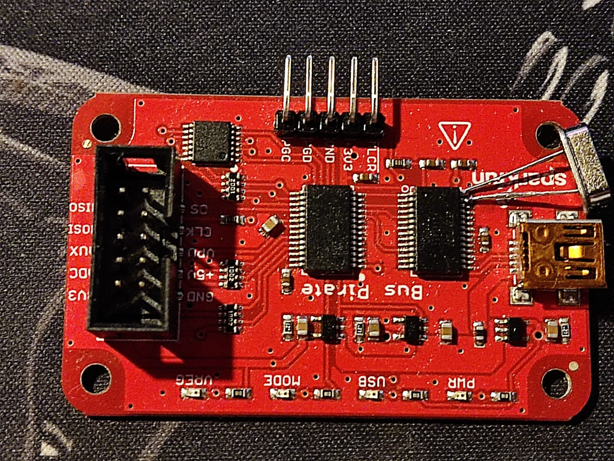
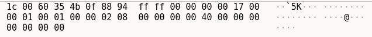
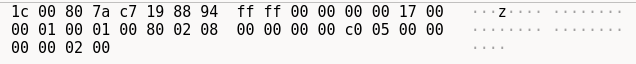
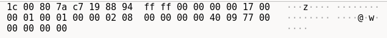
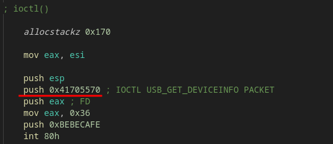

 # `FTDIBRICK` [WIP] 

@FTDIChip , How dangerous do you consider it that a non-admin user running a user-space program can communicate with the FTDI driver, program the EEPROM, and brick it? Does that seem normal to you?

Malware POC that takes advantage from the configuration of the eeprom on FT232R and FT245R and bricks the chip making it useless. The unique way to reverse this is to solder a proper clock to the OSCO and OSCI pins of the chip:



<span style="font-size:0.75em;">Fig 0.1: Bus Pirate V3 after clock installation</span>

We thinked of this program as a "shellcode" where you can inject the code on  memory and it will work

----

Do you remember when @FTDIChip 's driver bricked chinese clone chips? @s0sinh4 & I have code some POCs to brick original FT232R that don't use an external clock (almost all boards, right?) FreeBSD+Windows+Linux(WIP). On Windows from non-admin user, wtf

Lore:
- https://hackaday.com/2016/02/01/ftdi-drivers-break-fake-chips-again/
- https://hackaday.com/2014/10/24/ftdi-screws-up-backs-down/
- https://www.eevblog.com/forum/projects/are-ftdi-drivers-still-destroying-counterfeit-ft232-chips/
- https://forum.mysensors.org/topic/533/beware-ftdi-driver-update-will-brick-fake-ftdi-usb-to-serial-converters/12
- https://www.eevblog.com/forum/reviews/ftdi-driver-kills-fake-ftdi-ft232/
- http://forum.arduino.cc/index.php?topic=270175.0

----

# POCs (ugly code and buggy)

## Windows
- stuff/ftdibrickerd2xx
- stuff/ftdibrickerd2xx_static
- stuff/ftdibrickwin32_dreg_zadig_winusb
- stuff/ftdibrickwin32_dreg_devicecontrol

(Dreg's note about devicecontrol: I've only been with the debugger and IDA for a few hours! But the communication part of the driver works... None of this is documented on the internet or public ;-D)

## FreeBSD
- stuff/freebsd_dreg
- src/main.asm

## Linux [WIP]
- ...

---

# WHAT IS FTDI?

FTDI is a semiconductor company which major objective is to "bridge technologies". It is commonly known for it's USB-UART chips although they have a wide variety of chips

# FTDI EEPROM
Most of the FTDI's devices have an EEPROM which records the device's configuration. We will overwrite this configuration to setup a external clock. 
As there is no external clock at the moment, the chip will brick. 

# FTDI EXTERNAL OSCILLATOR

FT232R and FT245R devices have an integrated oscillator to simplify USB designs and reduce component count. When the internal oscillator is enable both the OSCI and OSCO pins are disconnected from the signals internally to the chip. After the use of `FTDIBRICK` we are making the FTDI chip think that there is a external clock connected to OSCI and OSCO pins and so "disabling" the internal oscillator, making the chip useless.

# USB PACKETS

For bricking the FTDI Chip we need to overwrite the EEPROM configuration, before writing we (must?) send three USB packets for the correct writing process:

* RESET: Reset both RX and TX buffer 



* POLL MODEM: Get poll modem status info



* LATENCY: Set latency




Once this is done we can write our malicious contents to the EEPROM:

FTDI has a curious manner of writing to the eeprom as you have to write two bytes in reverse order in a time and at the end of the writing you have to checksum your data, in this case this checksum is included on the bad_eeprom array

## IOCTL SYSCALL FREEBSD

The ioctl syscall sends two or more arguments, depending on the ioctl request you send. In the case of the image we send three arguments as we use USB_GET_DEVICEINFO :

1 - The address of a buffer
2 - The request type
3 - The File Descriptor



<span style="font-size:0.75em;">Fig 0.2: FTDIBRICK code, line 82</span>

The request type, this ioctl requests has cool stuff and so we made a deserializer for ioctl requests.

You may be wondering, what the hell is 0x41705570?

0x41705570 it's the USB_GET_DEVICEINFO packet with all the information ioctl needs to know for doing the work.

This is the structure of ioctl packets

```
        31   29 28                     16 15            8 7             0
 *	+---------------------------------------------------------------+
 *	| I/O | Parameter Length        | Command Group | Command       |
 *	+---------------------------------------------------------------+
```


31 - 29 bit: Defines whether you copy parameters in, or you copy them out, in our case the value of this bits is: 0b100 -> (4)

28 - 16 bit: Basically defines the buffer size ioctl needs to work, in this case, 0x170

15 - 8 bit: Represent the command group, in this case is 0x55 which in ascii is the character 'U', this specifies that the command group is for USB protocol

7 - 0 bit: Simply the command, in this case is 0x70 (112 in decimal), if we go to the definition of USB_GET_DEVICEINFO:


<span style="font-size:0.75em;">Fig 0.2: usb_ioctl.h definition</span>

We can see that it has the "ID" 112.

DISCLAIMER: You need to run the process as root to execute the malware!
