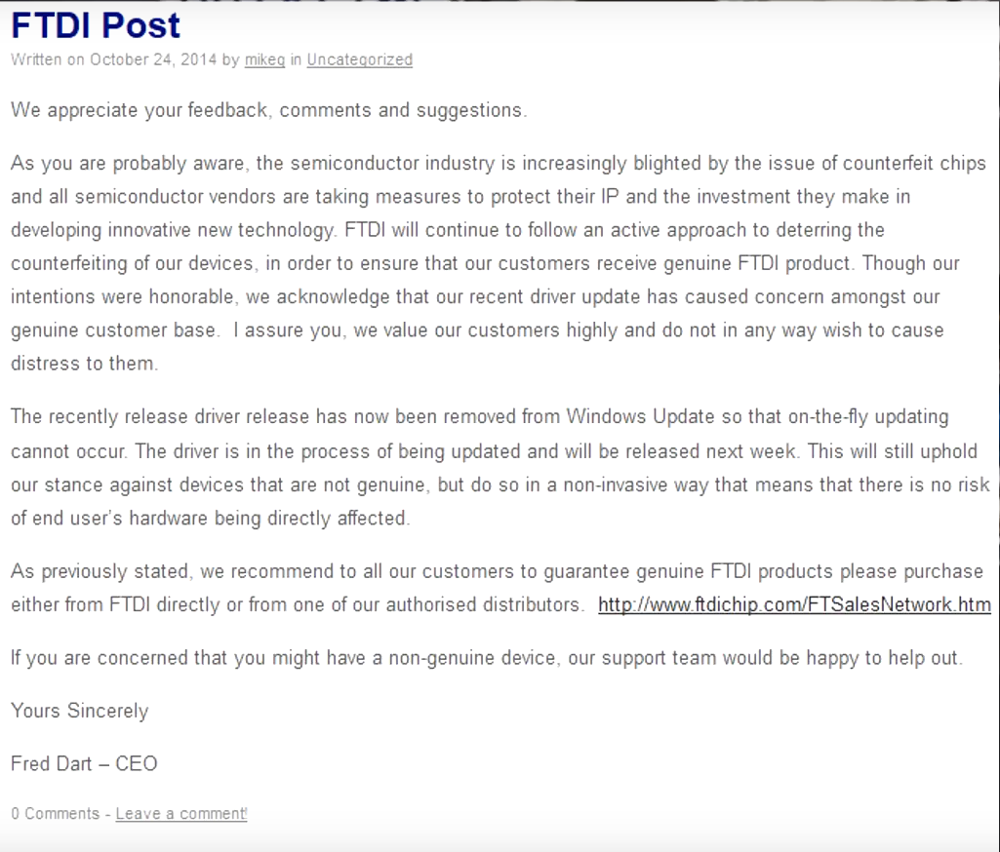
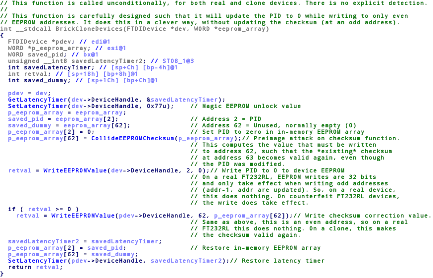
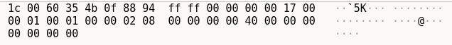
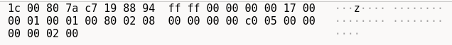
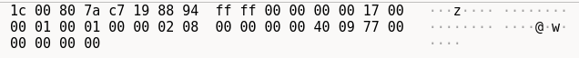
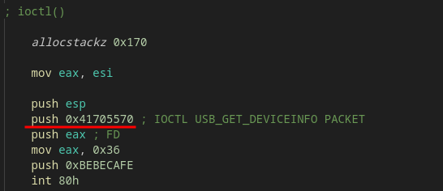

 # `FTDIBRICK`

@FTDIChip , How dangerous do you consider it that a non-admin user running a user-space program can communicate with the FTDI driver, program the EEPROM, and brick it? Does that seem normal to you?

We made some POC's to brick the original FT232R when it doesn't use an external clock (almost all boards, right?) FreeBSD+Windows+Linux. On Windows from non-admin user. The unique way to reverse this is to solder a proper 12Mhz clock to the OSCO and OSCI pins of the chip:


----

# FTDI DRIVER BRICKING FAKE CHIPS

Back in 2014 FTDI, manufacturers of the most popular USB to serial conversion chip, **released a update to their drivers that bricked FTDI fakes**. This fakes where extremely common in the supply chain, even if you bought a cheap arduino you probably have one of this fake chips. When you buy electronics you don't know if the chips they are using are original or not. This new driver could break their new stuff!
Even on advanced users, detecting if a FTDI chip is fake or not can be a jigsaw puzzle.

FTDI was heavily criticized because of this. Not only for refusing to talk to counterfeit chips, but for deliberately bricking the chinese fakes without a clear announcement (They advised the bricking of counterfeit chips in the Terms and Conditions, which was tucked away inside the driver file). After the critics they backed off and proceed with a new idea, this driver was eliminated from windows update.


Weeks later, After a CEO statement, they launched the `ftdi-gate v2.0` a new driver that will inject garbage data into the fake chip so the Windows FTDI driver will output "NON GENUINE DEVICE FOUND" and will refuse to talk to the chip.



### How FTDI brick the devices?

Every USB device has a pair of IDs. One, the Vendor ID (VID), which is given by the [USB Group](https://usb.org/). The second is a Product ID, allocated by the vendor with each distinct chip type having its own PID. Windows uses this VID/PID to figure out which driver the hardware needs. This fake chips use's the FTDI VID and set the PID to the PID of the chip they are cloning.

Back on 2014, the driver was on windows update, when you connected your fake FTDI into Windows, It will start downloading the latest driver for the FTDI, in this case, the bricker driver.

What this driver did was to reprogram the EEPROM of this counterfeit chips and set the PID to 0000. This PID does not match with any FTDI part, so Windows drivers no longer recognize the chip. As the PID is on the EEPROM the programming to 0000 is persistent.


### Diving deep

We have superficially explained how the brick process work, but let's get our hands dirty and go a bit deeper.

The user [marcan](https://marcan.st) reverse engineered the FTDI driver. The source code of the brick was kind of clever, the code exploits the differences found in the silicon of the counterfeit chips compared to the legit ones.



The eeprom needs to be written in 32-bit units, writes to even addresses are buffered and writes to odd addresses writes the 32 bits at once, the 16 buffered bits and the supplied 16 bits. The function does a 16 bit time transfer, on a official FTDI you need to write the EEPROM sequentially by writing 32 bits at a time, so , when using this function on a official FTDI you will send the first 16 bits to a buffer then buffer other 16 bits and then writing to the eeprom, meanwhile, the counterfeit FTDI's issues 16-bit writings (following the documentation on FTDI this should be the case for official FTDI, but the clones implemented the command interface better than FTDI, kind of hilarous).

 For the checksum they did something smart, they don't create a new checksum and write it on the FTDI, **but find the value required to make the existing checksum match and write it on the previous address to the checksum**

----

## Windows

For windows we decided to use their driver as it let us brick the chip without administrator privileges.

(ugly and buggy code starts here)

- stuff/windows_ftdibrick -> Assembly POC
- stuff/ftdibrickerd2xx
- stuff/ftdibrickerd2xx_static
- stuff/ftdibrickwin32_dreg_zadig_winusb -> POC for using with zadig, WinUSB
- stuff/ftdibrickwin32_dreg_devicecontrol

(Dreg's note about devicecontrol: I've only been with the debugger and IDA for a few hours! But the communication part of the driver works... None of this is documented on the internet or public ;-D)

## FreeBSD

- src/main.asm
- stuff/freebsd_dreg


## Linux

- src/fedora_ftdibrick
- src/libusb_ftdibrick -> POC using LibUsb for a generic linux FTDI brick!
---

# WHAT IS FTDI?

FTDI is a semiconductor company. It is heavily known for it's USB-UART chips (FTDI 232R, FTDI 245R ...) among other stuff like the well known USB MPSSE Cable Series (CH232HM) etc.


# FTDI EXTERNAL OSCILLATOR

FT232R and FT245R devices have an integrated oscillator to simplify USB designs and reduce component count. When the internal oscillator is enable both the OSCI and OSCO pins are disconnected from the signals internally to the chip. After the use of `FTDIBRICK` we are making the FTDI chip to use a external clock connected to OSCI and OSCO pins and so disabling the internal oscillator, making the chip useless as there is no external oscillator.

# USB PACKETS

For bricking the FTDI Chip we need to overwrite the EEPROM configuration, before writing we must send three USB packets for the correct writing process:

* RESET: Reset both RX and TX buffer



* POLL MODEM: Get poll modem status info



* LATENCY: Set latency (When latency is set to 0x77 it unlocks the EEPROM and allows writing)




Once this is done we can write our malicious contents to the EEPROM

## IOCTL SYSCALL FREEBSD/LINUX

(For this example we will be using FREEBSD, the difference between FREEBSD and LINUX is just the command code).

The ioctl syscall sends two or more arguments, depending on the ioctl request you send. In the case of the image we send three arguments as we use USB_GET_DEVICEINFO :

* The address of a buffer

* Request type

* File descriptor




The request type: The ioctl requests has some cool stuff and so we made a deserializer for ioctl requests, you can find it on `stuff/serializer`.

You may be wondering, what the hell is 0x41705570?

0x41705570 it's the USB_GET_DEVICEINFO packet with all the information ioctl needs to know for doing the work.

This is the structure of ioctl packets

```
        31   29 28                     16 15            8 7             0
 *	+---------------------------------------------------------------+
 *	| I/O | Parameter Length        | Command Group | Command       |
 *	+---------------------------------------------------------------+
```


31 - 29 bit: Defines whether you copy parameters in, or you copy them out, in our case the value of this bits is: 0b100 -> (4)

28 - 16 bit: Basically defines the buffer size ioctl needs to work, in this case, 0x170

15 - 8 bit: Represent the command group, in this case is 0x55 which in ascii is the character 'U', this specifies that the command group is for USB protocol

7 - 0 bit: Simply the command, in this case is 0x70 (112 in decimal), in this case USB_GET_DEVICEINFO:


DISCLAIMER: On Linux you need to run the process as root to execute the POCs!
